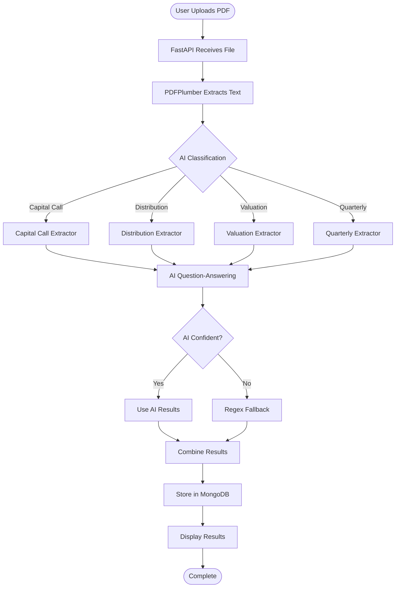

# Alternative Investments Document Intelligence

A comprehensive document processing system that automatically classifies and extracts structured data from alternative investment documents using AI-powered natural language processing and traditional regex-based extraction methods.

## Architecture Overview

This system is designed as a microservices-based application with three main components:

### Core Components

1. **Frontend (React + TypeScript)**: Modern web interface for document upload and results visualization
2. **Backend API (FastAPI + Python)**: RESTful API handling document processing, classification, and data extraction
3. **Database (MongoDB)**: Document storage and metadata management
4. **AI Processing Pipeline**: Hybrid AI/regex-based document classification and field extraction

### Document Types Supported

- **Capital Call Letters**: Extract fund ID, call date, call amounts, LP IDs, and call numbers
- **Distribution Notices**: Extract fund ID, distribution dates, amounts, LP IDs, and distribution types (ROC/CI)
- **Valuation Reports**: Extract valuation dates, methodologies, discount rates, multiples, and final valuations
- **Quarterly Updates**: Extract relevant KPIs, financial metrics, and performance highlights

### Technology Stack

- **Backend**: FastAPI, Python 3.11+, PyMongo, Transformers (Hugging Face)
- **Frontend**: React 18, TypeScript, Vite, Tailwind CSS, Axios
- **Database**: MongoDB
- **AI/ML**: Transformers (BERT/RoBERTa), Zero-shot classification, Question-Answering
- **Document Processing**: PDFPlumber, PyTesseract, PDF2Image
- **Deployment**: Docker, Docker Compose

## Setup
### Prerequisites
- Python 3.11+<br/>
- Node.js 18+<br/>
- npm<br/>
- MongoDB (local install) or Docker (for a containerized setup)

### 1. Clone the repository
   ```bash
   git clone https://github.com/<your-username>/alt-inv-doc-intel-prototype.git
   cd alt-inv-doc-intel-prototype
   ```
### 2. Local Development
   ### Backend (FastAPI)
   1. Create and activate virtual environment
      ```bash
      python -m venv venv
      source venv/bin/activate   # macOS/Linux
      venv\Scripts\activate      # Windows
      ```
   2. Install dependencies:
      ```bash
      pip install -r requirements.txt
      ```
   3. Start MongoDB (if it's not running already):
      ```bash
      mongod --dbpath /path/to/your/mongo/data
      ```
   4. Run backend:
      ```bash
      uvicorn app.api.api:app --reload --port 8000
      ```
      The API will be available at: http://localhost:8000

   ### Frontend (React + Vite)
   1. Go to frontend directory:
      ```bash
      cd frontend
      ```
   2. Install dependencies:
      ```bash
      npm install
      ```
   3. Start the dev server:
      ```bash
      npm run dev
      ```
      The UI will be available at: http://localhost:5173

### 3. Dockerized Setup
   1. Ensure Docker & Docker Compose are installed.
   2. From project root, build and start all services:
      ```bash
      docker compose up --build
      ```
      This runs:
      - MongoDB at localhost:27017
      - Backend API at http://localhost:8000
      - Frontend UI at http://localhost:3000
   3. Stop services:
      ```bash
      docker compose down
      ```

## System Architecture

### High-Level Architecture


### Data Flow

1. **Document Upload**: User uploads PDF via React frontend
2. **Document Processing**: FastAPI receives file, extracts text and tables using PDFPlumber
3. **Document Classification**: AI classifier determines document type (capital call, distribution, valuation, quarterly)
4. **Field Extraction**: Document-type-specific extractors use AI QA models + regex fallbacks
5. **Data Storage**: Extracted data and metadata stored in MongoDB
6. **Results Display**: Frontend retrieves and displays structured results

### AI Processing Pipeline

The system uses a hybrid approach combining AI and traditional methods:

- **Classification**: Zero-shot classification using Facebook's BART-large-MNLI model
- **Field Extraction**: Question-Answering using RoBERTa-large-SQuAD2 model
- **Fallback**: Regex-based extraction for reliability and performance
- **Configurable**: AI can be disabled via `DOCINTEL_AI=0` environment variable

### Document Processing Flow



### Component Architecture


### Deployment Architecture


## Usage 
1. Open http://localhost:3000 in your browser.
2. Upload a financial PDF document.
3. The system will classify the document and extract fields.
4. Results are displayed in the UI and stored in MongoDB.
